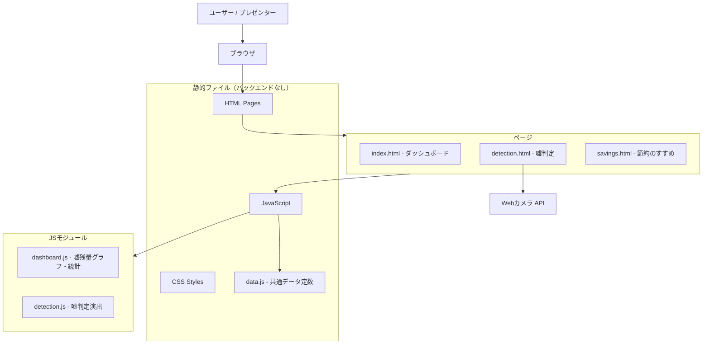
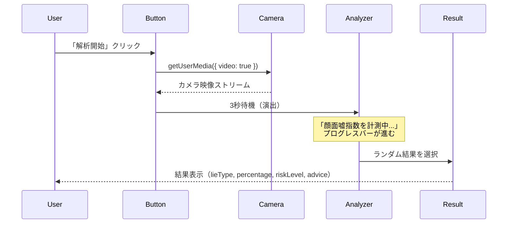
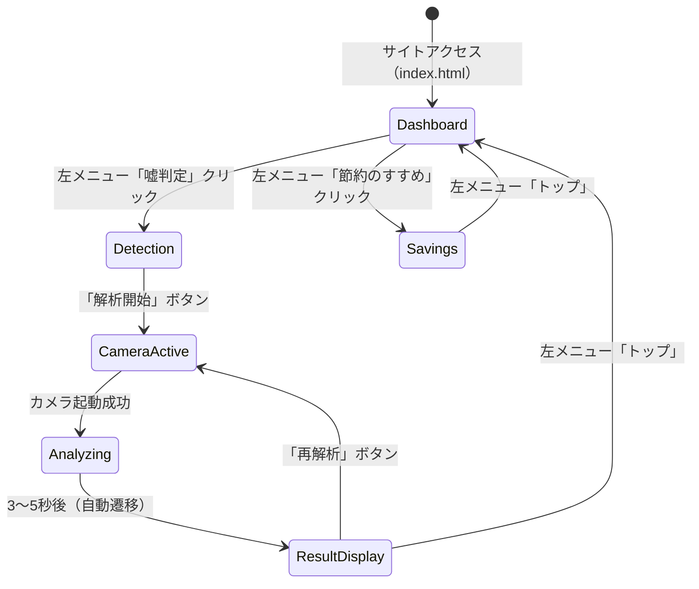

# 機能設計書 (Functional Design Document)

## システム構成図



## 技術スタック

| 分類 | 技術 | 選定理由 |
|------|------|----------|
| 言語 | HTML / CSS / Vanilla JS | バックエンド不要、デモ安定性最優先 |
| グラフ | Chart.js (CDN) | 軽量、折れ線グラフが簡単に実装可能 |
| フォント | MS PGothic (system font) | 2003年政府サイト再現に必須 |
| カメラ API | MediaDevices.getUserMedia() | ブラウザ標準、外部送信なし |
| データ | インラインJSON / JS定数 | インターネット接続不要 |

---

## データモデル定義

### 嘘残量データ (LieReserveData)

```typescript
interface LieReserveData {
  year: number;          // 年（例: 2000）
  month?: number;        // 月（省略時は年単位データ）
  amount: number;        // 残量（単位: キロウソ / Kuso）
  events?: LieEvent[];   // その時点のイベント（マーカー用）
}

interface LieEvent {
  label: string;         // イベント名（グラフ上に表示）
  xValue: number;        // X軸の年値（例: 2016）
  drop: number;          // 消費量（キロウソ）
  color: string;         // マーカー色（CSS color）
}
```

**具体的データ例（ハードコード）**:
```javascript
const LIE_RESERVE_HISTORY = [
  { year: 1990, amount: 98400 },
  { year: 1995, amount: 96200 },
  { year: 2000, amount: 93800 },
  { year: 2003, amount: 91853, events: [
    { label: "2003.8.14 14:22\n急落（原因不明）", xValue: 2003, drop: 847, color: "#cc0000" }
  ]},
  { year: 2008, amount: 87300, events: [
    { label: "リーマンショック\n関連説明", xValue: 2008, drop: 1200, color: "#996600" }
  ]},
  { year: 2016, amount: 79800, events: [
    { label: "米大統領選", xValue: 2016, drop: 3800, color: "#cc0000" }
  ]},
  { year: 2020, amount: 71200 },
  { year: 2022, amount: 58900, events: [
    { label: "AI（LLM）\n大量稼働開始", xValue: 2022, drop: 7400, color: "#990000" }
  ]},
  { year: 2024, amount: 41200 },
  { year: 2026, amount: 18700 },  // 現在（予測含む）
];
```

---

### 嘘大量消費事件 (LieIncident)

```typescript
interface LieIncident {
  rank: number;           // 順位
  name: string;           // 事件名
  year: string;           // 発生年（表示用）
  consumption: number;    // 消費量（キロウソ）
  consumptionRate: string; // 消費率（例: "全体の4.2%"）
  note: string;           // 備考
}
```

**TOP5 データ（ハードコード）**:
```javascript
const LIE_INCIDENTS_TOP5 = [
  {
    rank: 1,
    name: "第二次世界大戦期 枢軸国統合プロパガンダ作戦",
    year: "1939〜1945年",
    consumption: 18420,
    consumptionRate: "全体の18.7%",
    note: "複数国家による組織的嘘の同時大量放出。現在も影響が続く。"
  },
  {
    rank: 2,
    name: "AI大量ハルシネーション事案（進行中）",
    year: "2022年〜",
    consumption: 14300,
    consumptionRate: "全体の14.5%（現在も増加中）",
    note: "LLMによる嘘の機械的・連続的放出。史上初の人工消費源。"
  },
  {
    rank: 3,
    name: "米大統領選関連虚偽情報拡散",
    year: "2016年",
    consumption: 3840,
    consumptionRate: "全体の3.9%",
    note: "SNSを介した伝搬速度が過去最速を記録。"
  },
  {
    rank: 4,
    name: "2003年8月14日 14:22 急落事案",
    year: "2003年",
    consumption: 847,
    consumptionRate: "全体の0.86%",
    note: "原因特定に至らず。調査委員会は平成21年に解散。"
  },
  {
    rank: 5,
    name: "エイプリルフール複合消費（年間定例）",
    year: "毎年4月1日",
    consumption: 312,
    consumptionRate: "全体の0.32%（年間）",
    note: "嘘が文化的に許容される唯一の日。節約の観点から見直しが求められる。"
  }
];
```

---

### 嘘判定結果 (LieJudgmentResult)

```typescript
interface LieJudgmentResult {
  lieType: string;       // 嘘タイプ（例: "『一回家に取りに帰ります』系"）
  percentage: number;    // 傾向スコア（例: 73.2）
  riskLevel: RiskLevel;  // リスクレベル
  riskLabel: string;     // 表示用（例: "高（警戒レベル3）"）
  advice: string;        // 一言アドバイス
}

type RiskLevel = '低' | '中' | '高' | '極めて高';
```

**判定結果パターン（10種類以上、ランダム表示）**:
```javascript
const LIE_JUDGMENT_PATTERNS = [
  {
    lieType: "「一回家に取りに帰ります」系",
    percentage: 73.2,
    riskLevel: "高",
    riskLabel: "高（警戒レベル3）",
    advice: "公共交通機関の乗り換えで特に発症しやすい傾向にあります。"
  },
  {
    lieType: "「もうすぐ着きます」系（家を出ていない）",
    percentage: 81.4,
    riskLevel: "極めて高",
    riskLabel: "極めて高（警戒レベル4）",
    advice: "スマートフォンのGPS機能の普及により消費リスクが高まっています。"
  },
  {
    lieType: "「5分で終わります」系",
    percentage: 68.9,
    riskLevel: "高",
    riskLabel: "高（警戒レベル3）",
    advice: "会議室での発症例が最多です。推定所要時間に1.8を乗じることを推奨します。"
  },
  {
    lieType: "「前から知っていました」系",
    percentage: 44.7,
    riskLevel: "中",
    riskLabel: "中（警戒レベル2）",
    advice: "知的虚栄心に起因する類型です。今後の普及が懸念されます。"
  },
  {
    lieType: "「全然食べてないんですよ」系（食べている）",
    percentage: 62.3,
    riskLevel: "高",
    riskLabel: "高（警戒レベル3）",
    advice: "食事制限関連嘘の中では最も消費量が多い亜種です。"
  },
  {
    lieType: "「気にしてないです」系（気にしている）",
    percentage: 88.1,
    riskLevel: "極めて高",
    riskLabel: "極めて高（警戒レベル4）",
    advice: "帰宅後3〜4時間にわたって反芻する傾向が観測されています。"
  },
  {
    lieType: "「大丈夫です」系（大丈夫ではない）",
    percentage: 91.7,
    riskLevel: "極めて高",
    riskLabel: "極めて高（警戒レベル4）",
    advice: "最も汎用性の高い嘘類型です。年間消費量の試算が困難なほど多用されています。"
  },
  {
    lieType: "「また今度行きましょう」系（行く気がない）",
    percentage: 57.3,
    riskLevel: "中",
    riskLabel: "中（警戒レベル2）",
    advice: "社交辞令との境界が曖昧なグレーゾーン類型。資源の観点からは消費に分類されます。"
  },
  {
    lieType: "「読んでません」系（既読）",
    percentage: 76.5,
    riskLevel: "高",
    riskLabel: "高（警戒レベル3）",
    advice: "SNS・メッセージアプリの普及により急増中。既読通知機能が発症率を押し上げています。"
  },
  {
    lieType: "「今日は早く帰ります」系（残業確定）",
    percentage: 84.2,
    riskLevel: "極めて高",
    riskLabel: "極めて高（警戒レベル4）",
    advice: "金曜日の発症率が平日平均の2.3倍。上司の視線との相関が統計的に有意です。"
  },
  {
    lieType: "「運動してます」系（階段昇降のみ）",
    percentage: 39.8,
    riskLevel: "低",
    riskLabel: "低（警戒レベル1）",
    advice: "健康関連嘘の中では比較的消費量が少ない類型。ただし累積効果には注意が必要です。"
  }
];
```

---

## コンポーネント設計

### 1. 共通レイアウト (style.css)

**責務**: 全ページ共通の政府系ポータルUIを提供する

```
┌─────────────────────────────────────────────────────┐
│  [庁章マーク]  嘘資源管理庁（旧 嘘量調整本部）         │ ← header
│               Ministry of Lie Resources             │
├───────────┬─────────────────────────────────────────┤
│ ナビゲーション│                                       │
│ ・トップ    │  <main content>                        │
│ ・嘘残量状況│                                        │
│ ・嘘判定    │                                        │
│ ・節約のすすめ│                                       │
│ ・法令・通知│                                        │
│ ・採用情報  │                                        │
│ ・お問い合わせ│                                       │
│ ・サイトマップ│                                       │
├───────────┴─────────────────────────────────────────┤
│ Copyright © 平成19年 Ministry of Lie Resources.     │ ← footer
│ 本サイトはInternet Explorer 6.0以上での閲覧を推奨します │
│ 最終更新：平成31年4月                                 │
└─────────────────────────────────────────────────────┘
800px固定幅
```

**左サイドメニューのリンク**: 「法令・通知」「採用情報」「お問い合わせ」「サイトマップ」は `href="#"` でクリック不能（または `cursor: not-allowed`）

---

### 2. 嘘残量グラフ (dashboard.js)

**責務**: Chart.js を使って嘘残量の折れ線グラフを描画する

**グラフ仕様**:
- 種別: 折れ線グラフ（Line Chart）
- X軸: 年（1990〜2030年）
- Y軸: 残量（キロウソ / Kuso）、右肩下がり
- カラー: `#003399`（紺）
- 背景: 薄い紺グラデーション（`rgba(0,51,153,0.1)`）
- イベントマーカー: 特定データポイントに赤い縦線 + ラベル
- 現在値に「▼ 現在残量: 18,742 Kuso」表示

**統計パネル（グラフ右下）**:
| 項目 | 値 |
|---|---|
| 現在の残量 | 18,742 キロウソ |
| 前年比消費速度 | −31.2%（過去最速） |
| 枯渇予測年 | **西暦2029年**（推計） |
| 主要消費源（直近） | AI ハルシネーション（74.3%） |

---

### 3. 嘘判定モジュール (detection.js)

**責務**: Webカメラ映像を表示し、ランダムな嘘判定結果を演出する

**処理フロー**:



**エラーハンドリング（カメラ権限拒否時）**:
- `NotAllowedError`: 「カメラへのアクセスが拒否されました。本庁の権限で強制解析を実施します。」→ 通常通りランダム結果を表示

---

### 4. 嘘節約ページ (savings.html)

**責務**: 啓発パンフレット風の「嘘節約のすすめ」を表示する

**コンテンツ**:
```
① ささいな見栄を控えましょう
   「先週読んだ本」「見た映画」の数を正確に申告することで
   年間最大2.3キロウソの節約が見込まれます。

② 盛った武勇伝は3割引で話しましょう
   本庁調査によると、武勇伝の平均誇張率は187%です。
   3割引を目安に修正した上でお話しください。

③ SNSの自撮りの加工は1段階弱めましょう
   過度な補正は「嘘の高速複製」を引き起こします。
   本人と写真の差異が一定基準を超えた場合、
   将来的には申告義務の対象とする方向で検討中です。

④ 「少し遅れます」は正確な分数でお知らせください
   あいまいな時間申告は追加の嘘消費を誘発します。

⑤ 「大丈夫です」の使用を週3回以内にとどめましょう
   使用頻度が最も高い嘘類型です。
   代替表現「なんとかなります」「対処中です」の活用を推奨します。
```

---

## 画面遷移図



---

## UI設計

### カラーパレット

| 用途 | カラーコード | 色名 |
|---|---|---|
| メインカラー（ヘッダー・ボーダー） | `#003399` | 紺 |
| セカンダリ（テキスト・見出し） | `#336699` | くすんだ青 |
| テキスト（本文） | `#333333` | ダークグレー |
| 背景（サイド） | `#e8eef5` | 薄青グレー |
| 背景（本文） | `#ffffff` | 白 |
| 警告（急落マーカー） | `#cc0000` | 赤 |
| テーブルヘッダー | `#ccddee` | 薄青 |
| テーブル偶数行 | `#f0f5fa` | 極薄青 |

### フォント指定

```css
body {
  font-family: "MS PGothic", "MS Pゴシック", "ＭＳ Ｐゴシック", sans-serif;
  font-size: 13px; /* 2003年標準 */
}
h1 { font-size: 16px; }
h2 { font-size: 14px; }
```

### ページ幅

```css
#wrapper {
  width: 800px;
  margin: 0 auto;
}
#sidebar {
  width: 160px;
  float: left;
}
#main {
  width: 620px;
  float: right;
}
```

---

## エラーハンドリング

| エラー種別 | 発生箇所 | 処理 | ユーザーへの表示 |
|-----------|---------|------|-----------------|
| カメラ権限拒否 | 嘘判定ページ | ランダム結果を通常表示 | 「強制解析モードで実施します」 |
| カメラ非搭載 | 嘘判定ページ | ランダム結果を通常表示 | 「遠隔解析モードで実施します」 |
| Chart.js 読み込み失敗 | ダッシュボード | テーブルのみ表示 | グラフ欄に「データ準備中」 |
| JavaScript 無効 | 全ページ | noscript タグで案内 | 「本サイトはJavaScriptが必要です」 |

---

## セキュリティ考慮事項

- Webカメラ映像: `getUserMedia()` で取得したストリームはブラウザ内のみで使用。外部送信・録画・保存を一切行わない
- 個人情報: 入力フォームなし。収集・送信するデータなし
- CSP: インラインスタイルを最小化（Chart.jsラベルに必要な箇所を除く）
- XSS: 動的DOM生成時は `textContent` を使用し `innerHTML` は最小限に

---

## パフォーマンス最適化

- Chart.js は CDN から読み込み（バージョン固定: 4.x）
- グラフデータはすべてJSの定数としてインライン化（外部API不要）
- CSS・JSの最小化は不要（デモ用、安定性優先）
- Webカメラストリームはページ離脱時に `srcObject = null` で解放
